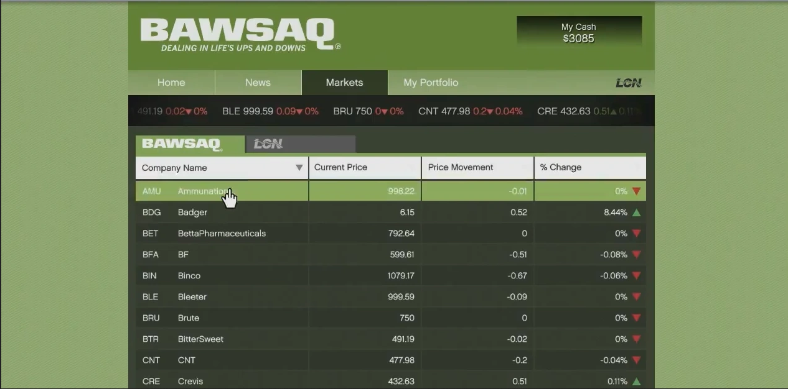

# Stock Market Simulator API

<p align="center">

</p>

<p align="center">
Photo by <a href="https://unsplash.com/@karishea?utm_source=unsplash&utm_medium=referral&utm_content=creditCopyText">Kari Shea</a> on <a href="https://unsplash.com/photos/1SAnrIxw5OY?utm_source=unsplash&utm_medium=referral&utm_content=creditCopyText">Unsplash</a>
</p>

### Welcome to Stock Market Simulation API, a GTA V Inspired Application

This is an exciting project developed to explore the depths of [Django Framework](https://www.djangoproject.com/) and expand proficiency in [Python](https://www.python.org/) programming. The concepts of this project were inspired by the game [GTA V](https://www.rockstargames.com/br/gta-v), specically on the [BAWSAQ](https://gta.fandom.com/wiki/BAWSAQ) and [LCN](https://gta.fandom.com/wiki/Liberty_City_National_Exchange) "Fake" Stock Markets. The API provides the basic operations like Buying and Selling Stocks and also provides a feature to simulation the stock market prices variation.


## Before Running

Run the following commands:

```sh
make migrations
```
```sh
make migrate
```
This commands will create a simple database on which the application will work.

## Running the Application
```sh
make run
```
The Server will run at http://0.0.0.0:8000/

## Using Docker

The project provide a Dockerfile allowing you to start a container with the Application.
Once you install Docker & Docker Compose on your computer ([see details here](https://docs.docker.com/)), you can run the following command:
```sh
docker-compose up
```

## Testing
```sh
make test
```
This command will run the Unit Tests implemented for the Application.

## Contact Info

Any question? I'm more than pleased to have a nice chat with you! 

[](https://github.com/biluca)
[](https://www.instagram.com/vinicios_biluca/)
[](https://www.linkedin.com/in/vinicios-biluca/)
