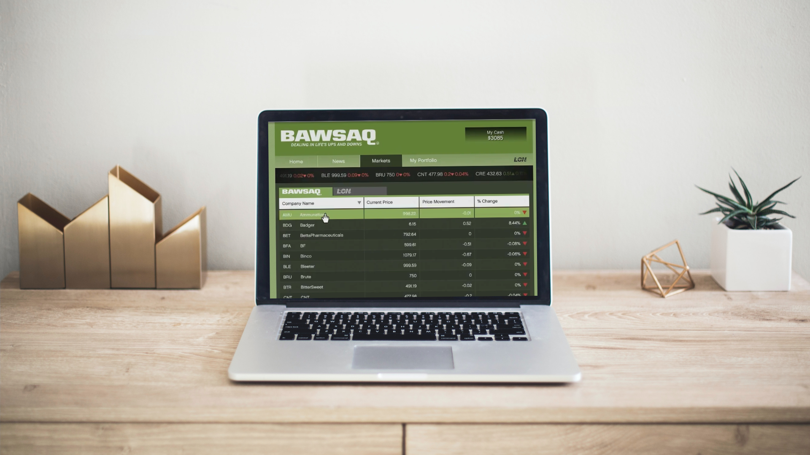

# Stock Market Simulator API

<p align="center">


*This logo was generated using [Dall-E-2](https://openai.com/dall-e-2) by [OpenAI](https://openai.com/)*
</p>

### Welcome to the Dumily Sunley a GTA V Inspired Stock Market API

This is an exciting project developed to explore the depths of [Django Framework](https://www.djangoproject.com/) and expand proficiency in [Python](https://www.python.org/) programming. The concepts of this project were based on the game [GTA V](https://www.rockstargames.com/br/gta-v), specically on the [BAWSAQ](https://gta.fandom.com/wiki/BAWSAQ) and [LCN](https://gta.fandom.com/wiki/Liberty_City_National_Exchange) Stock Markets. The API provides the basic operations like Buying and Selling Stocks.

<p align="center">


</p>

## Installation

Run the following commands:

```sh
make migrations
```
```sh
make migrate
```
This commands will create a simple database on which the application will work.

## Running the Application
```sh
make run
```
The Server will run at http://127.0.0.1:8000/

## Contact Info

Any question? I'm more than pleased to have a nice chat with you! 

[](https://github.com/biluca)
[](https://www.instagram.com/vinicios_biluca/)
[](https://www.linkedin.com/in/vinicios-biluca/)
